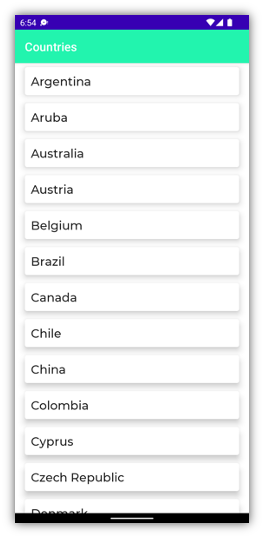
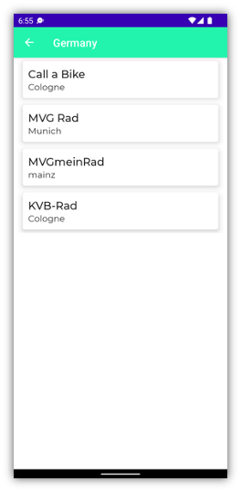
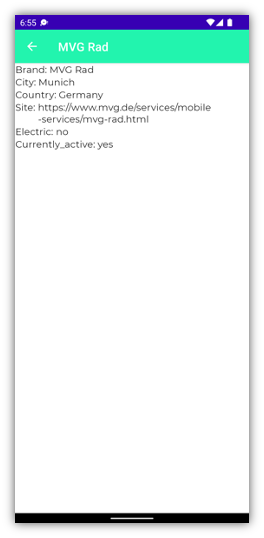
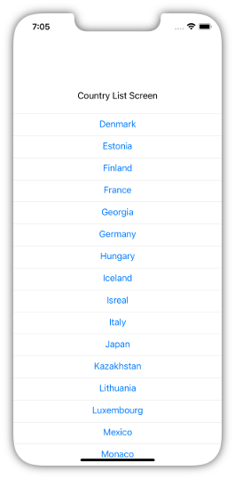
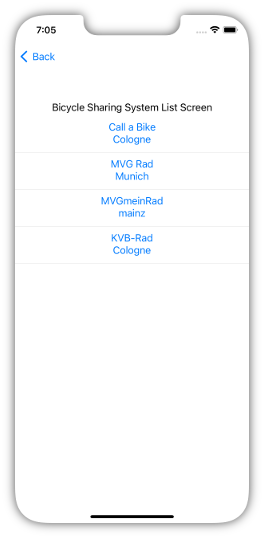
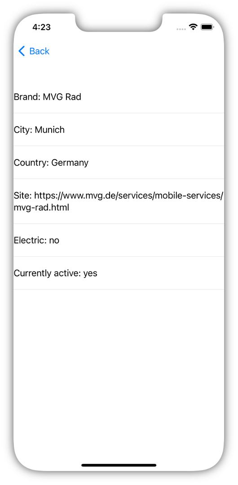

# kmmbikeshare

## Android

  <kbd> </kbd>
  <kbd></kbd>
  <kbd></kbd>
    

## iOs
  
  <kbd> </kbd>
  <kbd></kbd>
  <kbd></kbd>
    

## Run iOS App

To run the iOS app you need to follow these Steps: rebuild the app in
Android Studio `[Taskbar in AS → Build → Rebuild Project]` After that
you need Xcode. In the App Folder is a iosWeeFood Folder. From there you
can open the `workspace-file` in xcode. run the App with the Start Button
on top

## Issues when building the iOS app

In Case you never run a app in XCode there might be some issues. For
some of them I have found a solution. 

**At first:** Sometimes you have to build the app twice (have you tried turning it off and on again). And sometimes you need to rebuild the app in Android Studio
again.

## No Gradle Permission

open the Terminal in root directory from the app run: `chmod +x gradlew`
to give full permission

## gradlew wrapper is missing

open the Terminal in root directory from the app run:
`gradle; gradle wrapper` if gradle is missing: install gradle via
terminal run: `brew install gradle`

## shared or other modules are missing

open the Terminal in `iosApp` directory from the app run:
`pod deintegrate; pod install` to clean the pod and reinstall it

## SQL-Delight problems

go in xcode to the root project `iosApp → Targets` : set iosApp Filter to
`All` und `Combined` 

Build Settings → Linking → Other Linker Flag Set a new variable
`-lsqlite3`

## no command line tool set

go in xcode to `settings → locations` set a xcode version in the command
line tool sections

CoCoaPods <https://kotlinlang.org/docs/native-cocoapods.html>

Install the CocoaPods dependency manager: `sudo gem install cocoapods`

Install the cocoapods-generate plugin: `sudo gem install cocoapods-generate`

## Coroutines

Use the suffix `native-mt` for the coroutine dependencies
`const val coroutines = "1.6.0-native-mt"`

<https://stackoverflow.com/questions/66917563/kmm-on-ios-there-is-no-event-loop-use-runblocking-to-start-one>

## framework not found 
Remove: Pods.framework in: Folder named Pods

## Mac M1 Probleme

CocoaPods will not be installed:
<https://medium.com/p-society/cocoapods-on-apple-silicon-m1-computers-86e05aa10d3e>

`cd iosApp || exit arch -x86\_64 pod install`

